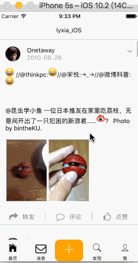
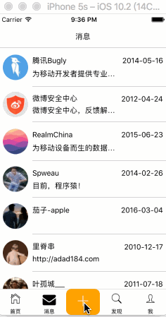

### React Native 仿微博客户端
iOS & Android</br>
react-native 版本 0.40.0</br>
mobx、redux 架构</br>
### 已完成
1、微博首页</br>
2、微博详细页</br>
3、点赞</br>
4、未读消息红点</br>
5、发布页面动画</br>
6、微博内容的emoji</br>
7、保存token，自动验证token，预加载userInfo</br>
### 运行
1、git clone https://github.com/lyxia/RNWeiBo</br>
2、cd RNWeiBo</br>
3、npm install</br>
4、react-native link（这一步是为了添加react-native-vector-icons）</br>
5、在[微博API中添加应用](http://open.weibo.com/wiki/%E5%BE%AE%E5%8D%9AAPI)，在./js/server/API中修改授权值：
```
const redirect_uri = '...'
const client_id = '...'
const client_secret ='...'
```
6、react-native run-ios/run-android</br>
### 效果图
</br>
</br>
</br>
